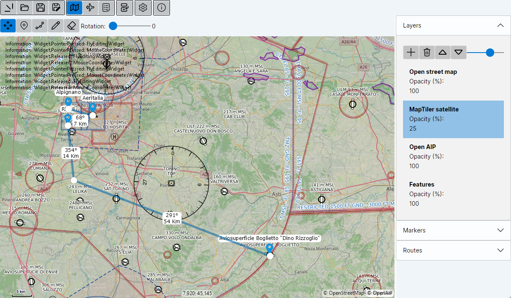
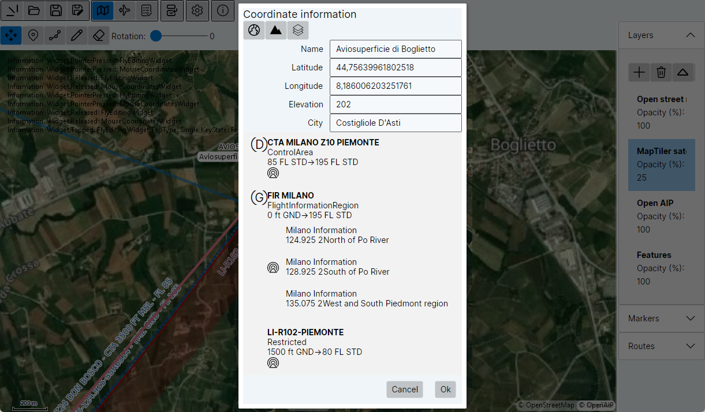
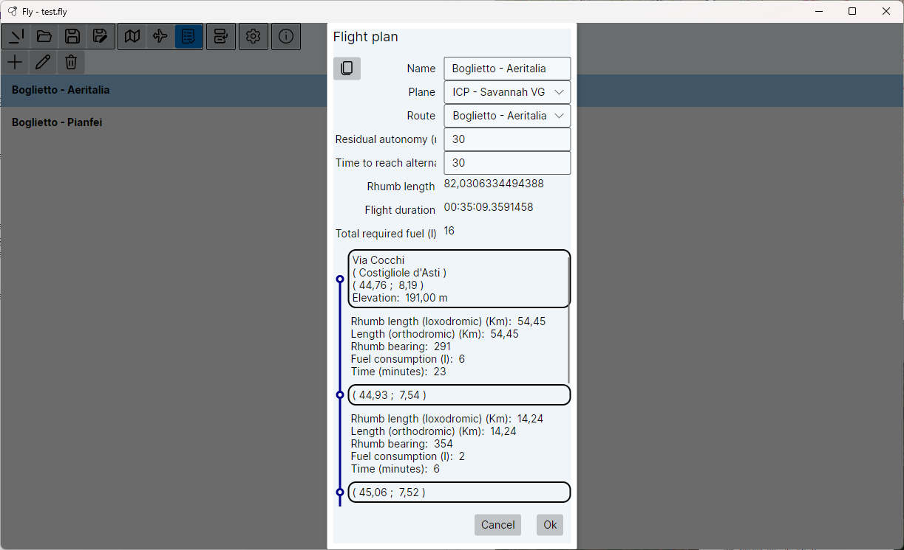
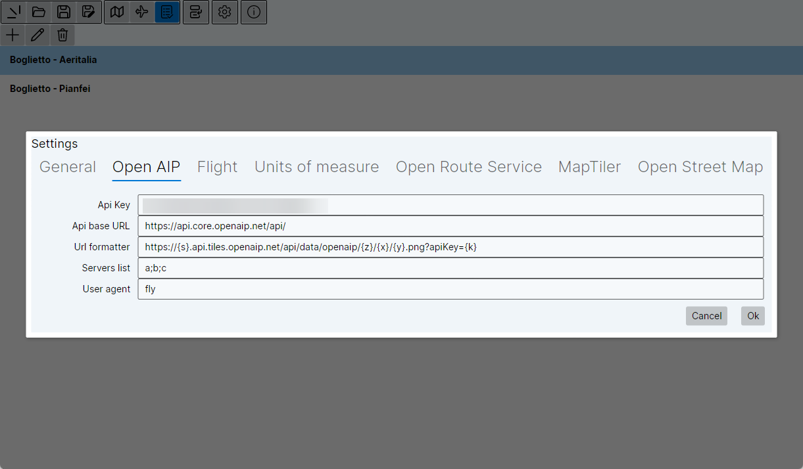

# Fly


A buggy application for hobby pilots to plan their flights.

## At glance









## Disclaimer
- For educational purposes only.
- Absolutely NOT suitable for practical planning.
- Use at your own risk.
- Currently (2024-07-28) only "Desktop" mode for win-x64 has been tested.

## Features

- Visually add and edit markers and routes on maps
- Automatically display route-leg length and direction
- Map information provided by [OpenStreetMap](https://www.openstreetmap.org/), [MapTiler](https://maptiler.com/), [OpenAIP](https://www.openaip.net/), [Open Route Service](https://openrouteservice.org)
- Fetch airspace information for coordinate from [OpenAIP](https://www.openaip.net/)
- Edit aircraft properties
- Calculate flight plan timings and fuel consumption

## Built using

- [.Net 8.0](https://dotnet.microsoft.com/en-us/download/dotnet/8.0)
- [Avalonia UI](https://avaloniaui.net/)
- [MapsUI](https://mapsui.com/)
- [Avalonia.Preferences](https://github.com/sandreas/Avalonia.Preferences)
- [AutoMapper](https://automapper.org/)
- [DialogHost.Avalonia](https://github.com/AvaloniaUtils/DialogHost.Avalonia)

## Compile and run

### Requirements

- [.Net 8.0](https://dotnet.microsoft.com/en-us/download/dotnet/8.0)
- [Avalonia UI](https://avaloniaui.net/gettingstarted#installation)

### Building

From Powershell, cd in the solution directory, then you should be able to compile and build the solution using the following command:

```shell
dotnet publish --configuration Release --self-contained=true /p:PublishSingleFile=true --runtime win-x64
```

Find the binaries in the `bin\Release\net8.0\win-x64\publish` subfolder.

### Runtime requirements

To take advantage of all features, you should register to the following services and get an API key:
- [MapTiler](https://maptiler.com/)
- [OpenAIP](https://www.openaip.net/)
- [Open Route Service](https://openrouteservice.org)

Once the application is running, the API keys and URLs should be configured in the corresponding "Settings" view, accessible through the "Settings" button:


Typical configurations are:

- OpenAIP:
  - API key: \<your OpenAIP API key\>
  - API base URL: `https://api.core.openaip.net/api/`
  - URL formatter: `https://{s}.api.tiles.openaip.net/api/data/openaip/{z}/{x}/{y}.png?apiKey={k}`
  - Servers list: `a;b;c`
  - User agent: `fly`

- Open Route Service:
  - API key: \<your Open Route Service API key\>
  - API base URL: `https://api.openrouteservice.org`

- MapTiler:
  - API key: \<your MapTiler API key\>
  - URL formatter: `https://api.maptiler.com/maps/hybrid/{z}/{x}/{y}.jpg?key={k}`
  - User agent: `fly`

- OpenStreetMap (no API key is required):
  - URL formatter: `https://tile.openstreetmap.org/{z}/{x}/{y}.png`
  - User agent: `fly`

## Notes

### Preferences persistency

Preferences persistency is implemented with [Avalonia.Preferences](https://github.com/sandreas/Avalonia.Preferences). This uses the `IsolatedStorageFile` API under the hoods, so the location of the storage depends on the OS.
On Windows 11 it is under: `%LocalAppData%\IsolatedStorage`,
On Debian 12 (bookworm) it is under: `~/.local/share/IsolatedStorage`.
See [this comment](https://github.com/sandreas/Avalonia.Preferences/issues/3#issuecomment-2255786137).

### The `.fly` file format

`.fly` files are just zip'd .json files containing all information about a document.